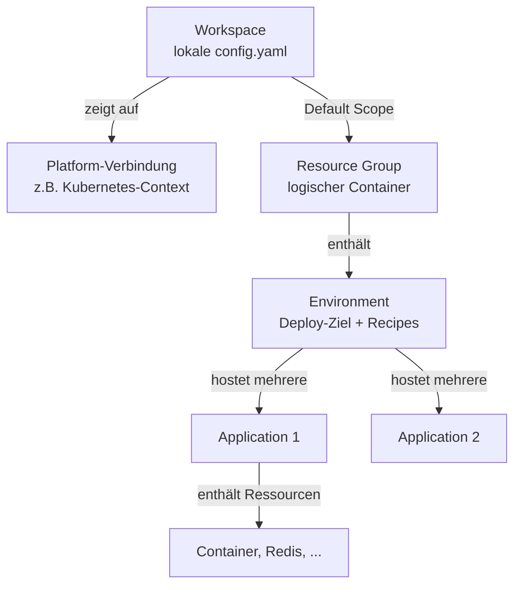

# Radius: Workspaces, Groups, Environments und Applications

> Dieses Dokument wurde KI-generiert.

## Wie hängen Workspace, Environment, Group und Application zusammen?

Vier Radius-Konzepte, die leicht verwechselt werden, weil `rad init` mehrere davon auf einmal anlegt:



- **Workspace**: rein lokal, in `~/.rad/config.yaml`. Er sagt dem `rad` CLI: "mit welcher Radius-Control-Plane (Kubernetes-Cluster) rede ich" und "welches Environment/welche Group ist gerade aktiv (Default)". Mehrere Workspaces bedeuten mehrere Cluster/Control-Planes, zwischen denen mit `rad workspace switch` gewechselt wird.
- **Resource Group**: ein Radius-interner Container (nicht identisch mit einer Azure Resource Group), in dem Environments und Applications organisiert werden. Rechte und Sichtbarkeit lassen sich pro Group trennen.
- **Environment**: definiert, wo deployt wird (Kubernetes-Namespace, AWS-Account/Region, Azure-Subscription/Resource-Group) und welche Recipes dabei für welchen Resource Type benutzt werden. Ein Environment kann mehrere Applications hosten.
- **Application**: der eigentliche Namespace für Ressourcen (Container, Redis, SQL, ...) im Application Graph. Sie hat kaum Eigenschaften außer dem Namen, ist aber die Einheit, mit der `rad application graph`, `rad application status` etc. arbeiten.

## Was macht `rad init` konkret?

1. Legt eine Resource Group an (Standardname entspricht dem Environment-Namen, z. B. `default`).
2. Legt darin ein Environment an (Ziel-Cluster/Namespace, optional Recipes).
3. Schreibt einen Workspace-Eintrag in `config.yaml`, der auf diese Group und dieses Environment zeigt und ihn als Default markiert, sodass `--group`/`--environment` bei folgenden Befehlen entfallen.
4. Legt im aktuellen Verzeichnis das Applikations-Scaffolding an (Bicep-Datei plus `bicepconfig.json` mit dem Radius-Bicep-Extension-Feed).

Was `rad init` nicht dauerhaft speichert, ist der Applikationsname. Dieser wird nicht in `config.yaml` abgelegt.

## Warum trotzdem `--application` bei `rad run`/`rad deploy`?

Application-Bicep-Dateien deklarieren `application` typischerweise als Pflichtparameter ohne Default:

```bicep
@description('The Radius Application ID. Injected automatically by the rad CLI.')
param application string
```

Anders als `environment` und `group` ist `application` kein Wert, der im Workspace (`config.yaml`) als Default hinterlegt werden kann. Es gibt keinen automatischen Fallback auf den Ordnernamen und keinen Befehl wie `rad application switch`. `--application` muss daher bei jedem `rad run`/`rad deploy` explizit angegeben werden, sonst bricht der Befehl mit `No application was specified` ab.

Der Kommentar `Injected automatically by the rad CLI` in generierten Bicep-Dateien bezieht sich nur darauf, dass der CLI den Parameterwert aus `--application` in den Bicep-Parameter einsetzt, nicht darauf, dass ein Name automatisch abgeleitet wird.

Kurz: Environment und Group sind Workspace-Defaults, Application ist es nicht, weil ein Environment mehrere Applications gleichzeitig hosten kann und Radius nicht raten soll, welche gemeint ist.

## Ein sinnvolles dev/staging/prod Setup

Empfohlen wird ein anwendungszentrierter Ansatz:

| Umgebung | Group | Environment | Platform/Scope | Recipes |
|---|---|---|---|---|
| dev | `<app>` | `dev` | lokaler Kubernetes-Namespace | lokale/dev-Recipes |
| staging | `<app>` | `staging` | Cloud-Namespace, gleiche Subscription | Cloud-Recipes mit kleinerem SKU |
| prod | `<app>` | `prod` | eigener Cloud-Namespace/eigene Subscription | Cloud-Recipes mit HA/Backups, restriktivere Rollen |

Praktisches Vorgehen:

```bash
# einmalig je Umgebung
rad group create <app>
rad env create dev --group <app>
rad env create staging --group <app>
rad env create prod --group <app>

# je Recipe pro Environment registrieren
rad recipe register default --environment prod --group <app> ...

# eigener Workspace pro Ziel-Cluster/Kontext
rad workspace create kubernetes dev-ws --environment /planes/radius/local/resourcegroups/<app>/providers/applications.core/environments/dev
rad workspace create kubernetes prod-ws --environment ... /environments/prod

# Deploy mit explizitem Applikationsnamen, unabhängig vom Ordnernamen
rad deploy app.bicep --application <app> --environment dev --group <app>
rad deploy app.bicep --application <app> --environment prod --group <app>
```

Wichtige Prinzipien:

- Ein Application-Name über alle Stufen hinweg, nur das Environment wechselt. Das entspricht dem Grundgedanken von Radius: gleiche Applikationsdefinition, unterschiedliche Recipes und Infrastruktur je Environment.
- Pro Team oder Applikation eine eigene Group, damit Rechte und Recipes nicht mit anderen Applikationen kollidieren.
- Workspaces sind rein lokal/client-seitig. Jede Person oder Pipeline kann eigene Workspace-Namen haben, die auf dieselben Environments zeigen. Sie sind kein Sicherheitsmechanismus, nur eine Komfortfunktion für Defaults.
- Produktive Environments sollten eigene Cloud-Subscriptions/Resource-Groups und eigene Recipe-Registrierungen mit restriktiveren Parametern verwenden, etwa SKU, Backup-Redundanz und Rollenzuweisungen.
