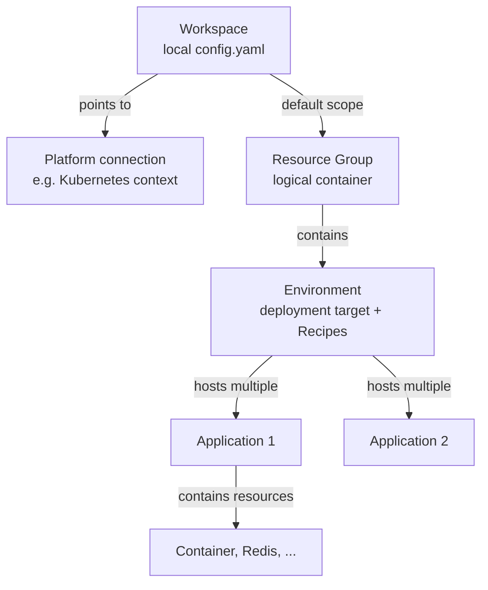

# Radius: Workspaces, Groups, Environments, and Applications

> This document is AI generated and should be reviewed before use.

## How do Workspace, Environment, Group, and Application relate?

Four Radius concepts that are easy to confuse because `rad init` creates several of them at once:



- **Workspace**: purely local, stored in `~/.rad/config.yaml`. It tells the `rad` CLI which Radius control plane (Kubernetes cluster) to talk to and which environment/group is currently the default. Multiple workspaces mean multiple clusters/control planes, switched between with `rad workspace switch`.
- **Resource Group**: a Radius-internal container (not the same as an Azure resource group) used to organize environments and applications. Permissions and visibility can be separated per group.
- **Environment**: defines where resources are deployed (Kubernetes namespace, AWS account/region, Azure subscription/resource group) and which Recipes are used for which resource type. One environment can host multiple applications.
- **Application**: the actual namespace for resources (containers, Redis, SQL, and so on) in the application graph. It has almost no properties besides its name, but it is the unit that `rad application graph`, `rad application status`, and similar commands operate on.

## What does `rad init` actually create?

1. Creates a resource group (default name matches the environment name, for example `default`).
2. Creates an environment within it (target cluster/namespace, optionally Recipes).
3. Writes a workspace entry in `config.yaml` pointing to this group and environment and marking it as default, so `--group`/`--environment` can be omitted from subsequent commands.
4. Creates the application scaffolding in the current directory (a Bicep file plus a `bicepconfig.json` with the Radius Bicep extension feed).

What `rad init` does not persist is the application name. It is not stored in `config.yaml`.

## Why is `--application` still required for `rad run`/`rad deploy`?

Application Bicep files typically declare `application` as a required parameter with no default:

```bicep
@description('The Radius Application ID. Injected automatically by the rad CLI.')
param application string
```

Unlike `environment` and `group`, `application` cannot be stored as a default in the workspace (`config.yaml`). There is no automatic fallback to the folder name and no command like `rad application switch`. `--application` must be passed explicitly on every `rad run`/`rad deploy`, otherwise the command fails with `No application was specified`.

The comment `Injected automatically by the rad CLI` in generated Bicep files only means that the CLI substitutes the value passed via `--application` into the Bicep parameter, not that a name is derived automatically.

In short: environment and group are workspace defaults, application is not, because one environment can host multiple applications and Radius should not guess which one is meant.

## A sound dev/staging/prod setup

An application-centric approach is recommended:

| Environment | Group | Environment | Platform/Scope | Recipes |
|---|---|---|---|---|
| dev | `<app>` | `dev` | local Kubernetes namespace | local/dev Recipes |
| staging | `<app>` | `staging` | cloud namespace, same subscription | cloud Recipes with a smaller SKU |
| prod | `<app>` | `prod` | dedicated cloud namespace/subscription | cloud Recipes with HA/backups, more restrictive roles |

Practical steps:

```bash
# once per environment
rad group create <app>
rad env create dev --group <app>
rad env create staging --group <app>
rad env create prod --group <app>

# register recipes per environment
rad recipe register default --environment prod --group <app> ...

# a dedicated workspace per target cluster/context
rad workspace create kubernetes dev-ws --environment /planes/radius/local/resourcegroups/<app>/providers/applications.core/environments/dev
rad workspace create kubernetes prod-ws --environment ... /environments/prod

# deploy with an explicit application name, independent of the folder name
rad deploy app.bicep --application <app> --environment dev --group <app>
rad deploy app.bicep --application <app> --environment prod --group <app>
```

Key principles:

- Use one application name across all stages, only the environment changes. This matches the core idea of Radius: same application definition, different Recipes and infrastructure per environment.
- Use a dedicated group per team or application so permissions and Recipes do not collide with other applications.
- Workspaces are purely local/client side. Each person or pipeline can have its own workspace names pointing to the same environments. They are not a security mechanism, just a convenience for defaults.
- Production environments should use dedicated cloud subscriptions/resource groups and dedicated recipe registrations with more restrictive parameters, such as SKU, backup redundancy, and role assignments.
